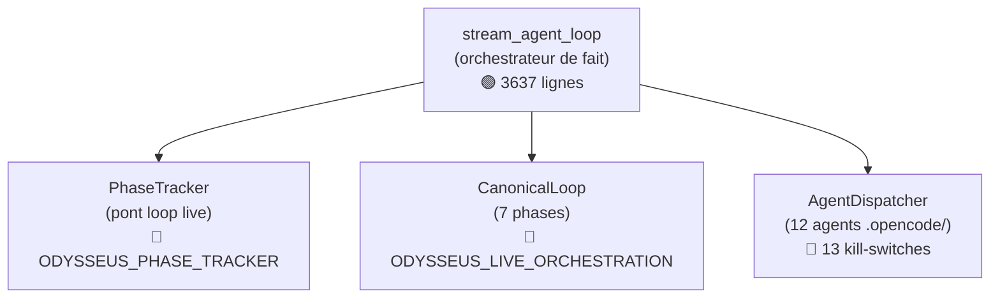

# Architecture — Boucle agent et orchestration

## La boucle canonique (7 phases)

```
CLASSIFY → KNOW → PLAN → BUILD → QUALITY → AUTOEVAL → MEMORY_OBSERVE
```

| Phase | Description | Outils | Catégories bloquées |
|-------|-------------|--------|---------------------|
| CLASSIFY | Classification du risque — lecture seule | Aucun | write, exec, destructive |
| KNOW | Récupération mémoire/connaissance | Aucun | write, exec, destructive |
| PLAN | Planification — écriture limitée à `process/` + `.planning/` | Aucun | exec, destructive |
| BUILD | Implémentation — accès complet | Tous | Aucun |
| QUALITY | Tests et lint uniquement | Test | write, destructive |
| AUTOEVAL | Auto-évaluation — pas de destruction | Eval | destructive |
| MEMORY_OBSERVE | Distillation mémoire et observabilité | Mémoire | destructive |

> **Réalité :** Les 7 phases existent dans `CanonicalLoop` (gated OFF). La boucle réelle est `stream_agent_loop` — une fonction de 3637 lignes dans `src/agent_loop.py`.

## Orchestrateur réel

```mermaid
sequenceDiagram
    participant UI as Navigateur
    participant App as app.py
    participant Loop as stream_agent_loop
    participant LLM as llm_core
    participant Tools as tool_execution
    participant Obs as Observer

    UI->>App: POST /api/chat/stream
    App->>Loop: stream_agent_loop(session, message)
    loop Chaque round
        Loop->>LLM: stream_llm_with_fallback()
        LLM-->>Loop: SSE stream
        Loop->>Tools: execute_tool_block()
        Tools-->>Loop: Résultat
        Loop->>Obs: ingest_metrics()
    end
    Loop-->>UI: SSE events
```

## Kill-switches d'orchestration

| Switch | Défaut | Effet |
|--------|--------|-------|
| `ODYSSEUS_DESTRUCTIVE_GATE` | **ON** | Bloque `rm -rf`, `mkfs`, fork bombs |
| `ODYSSEUS_PHASE_TRACKER` | OFF | Active le tracking de phase par round |
| `ODYSSEUS_LIVE_ORCHESTRATION` | OFF | Active CanonicalLoop 7 phases |
| `ODYSSEUS_LANGGRAPH` | OFF | Active la boucle LangGraph (7 nœuds) |
| `ODYSSEUS_AUTOEVAL` | OFF | Keep/revert post-build via git |
| `ODYSSEUS_GOVERNANCE_ANCESTRY` | OFF | Écrit GoalTask avec ancestry |
| `ODYSSEUS_CHECKPOINT` | OFF | Persiste checkpoint Obsidian |
| `ODYSSEUS_CODEBURN` | OFF | Rapport one-shot rate |

## Les 3 orchestrateurs (tous gated OFF)



## Agents spécialisés (12)

Tous dans `.opencode/agents/`, tous gated OFF :

| Agent | Phase | Kill-switch |
|-------|-------|-------------|
| `constitution` | CLASSIFY | `ODYSSEUS_AGENT_CONSTITUTION` |
| `gsd-planner` | PLAN | `ODYSSEUS_AGENT_PLANNER` |
| `gsd-researcher` | PLAN | `ODYSSEUS_AGENT_RESEARCHER` |
| `gsd-executor` | BUILD | `ODYSSEUS_AGENT_EXECUTOR` |
| `gsd-debugger` | BUILD (fail) | `ODYSSEUS_AGENT_DEBUGGER` |
| `debate-5-personas` | QUALITY | `ODYSSEUS_AGENT_DEBATE` |
| `security-audit` | QUALITY | `ODYSSEUS_AGENT_SECURITY` |
| `gsd-verifier` | AUTOEVAL | `ODYSSEUS_AGENT_VERIFIER` |
| `edge-case-gen` | AUTOEVAL | `ODYSSEUS_AGENT_EDGECASE` |
| `gsd-roadmapper` | MEMORY_OBSERVE | `ODYSSEUS_AGENT_ROADMAPPER` |
| `design-extract` | Explicite | `ODYSSEUS_AGENT_DESIGN_EXTRACT` |
| `open-design` | Explicite | `ODYSSEUS_AGENT_OPEN_DESIGN` |

---

→ Voir aussi : [Vue d'ensemble](overview.md) · [Services](services.md) · [INDEX-MAITRE](../../.planning/INDEX-MAITRE.md) · `loop-canonique.md`
