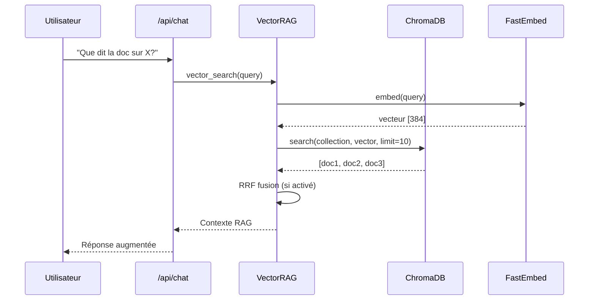
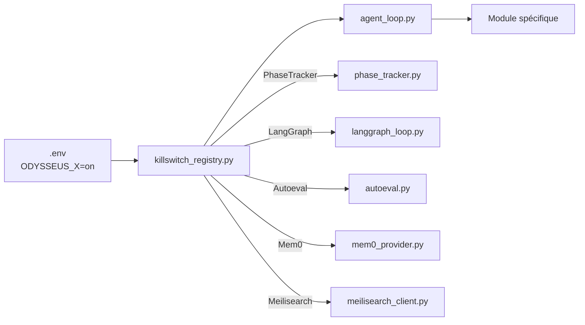

# Architecture — Flux de données

## Création de projet (chat → LLM → outils)

```mermaid
sequenceDiagram
    participant U as Utilisateur
    participant UI as Navigateur
    participant API as /api/chat
    participant Loop as stream_agent_loop
    participant LLM as llm_core
    participant Tool as tool_execution
    participant Mem0 as Mem0Provider
    participant Obs as Observer

    U->>UI: "Crée un script Python..."
    UI->>API: POST /api/chat (SSE)
    API->>Loop: stream_agent_loop(session, message)
    Loop->>Loop: _classify_agent_request()
    Loop->>Loop: _build_system_prompt()
    Loop->>LLM: stream_llm_with_fallback()
    LLM-->>Loop: Token streaming
    Loop->>Tool: execute_tool_block("bash", "echo...")
    Tool-->>Loop: Résultat stdout
    Loop->>Mem0: add_conversation(session, messages)
    Mem0-->>Loop: Faits extraits
    Loop->>Obs: ingest_metrics()
    Loop-->>API: SSE events
    API-->>UI: Streaming response
    UI-->>U: "PONG"
```

## Recherche RAG



## Observation et traces

```mermaid
sequenceDiagram
    participant Loop as agent_loop
    participant Tool as tool_execution
    participant Obs as Observer
    participant TW as trace_writer

    Loop->>Tool: execute_tool()
    Tool->>TW: write_trace(tool_call)
    Tool-->>Loop: Résultat + cost_tokens
    Loop->>Obs: ingest_metrics(round_data)
    Obs->>Obs: compute_drift_score()
    Loop->>TW: record_run_tokens(total)
    Loop-->>UI: SSE run_status (phase, drift, iters)
```

## Kill-switch → Code



---

→ Voir aussi : [Vue d'ensemble](overview.md) · [Boucle agent](agent-loop.md) · [Observabilité](../operations/observability.md)
