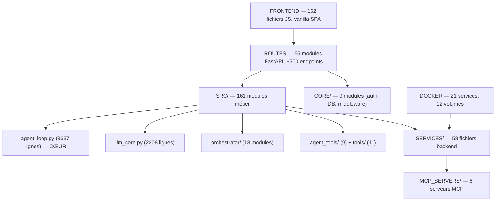
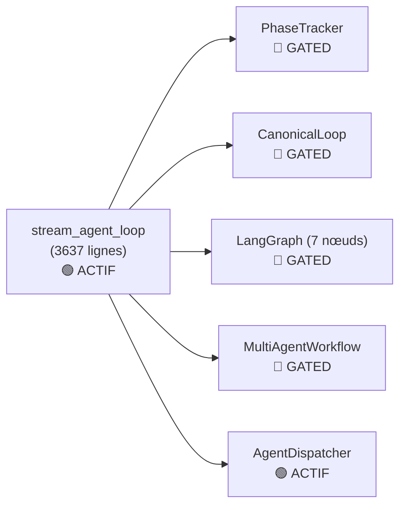

# Architecture — Vue d'ensemble

## Flux principal

```
Navigateur → FastAPI (app.py) → Auth → Routes → Chat Handler → stream_agent_loop
                                      ↓
                              LLM (llm_core) → Zen/LiteLLM → Modèle
                                      ↓
                              Tools (tool_execution) → bash/files/web/MCP
                                      ↓
                              Observer → trace_writer → JSONL traces
```

## Couches



## Stack technique

| Couche | Technologie |
|---------|------------|
| Backend | Python 3.14, FastAPI, Uvicorn |
| LLM Routing | LiteLLM + Zen Router (OpenCode Go) |
| Frontend | Vanilla JS SPA (162 fichiers), Tailwind CSS v4 (16.3 KB) |
| Database | SQLite (SQLAlchemy), ChromaDB (vecteur), Qdrant (optionnel) |
| Auth | bcrypt, pyotp TOTP, session cookies |
| MCP | 6 serveurs built-in + 5 Docker externes |
| Déploiement | Docker Compose (21 services, 12 profils) |
| CI/CD | GitHub Actions (9 workflows) |
| Tests | pytest (662 fichiers, 4393 pass) |

## Chiffres clés

| Métrique | Valeur |
|----------|--------|
| Fichiers Python | 989 (~160K lignes) |
| Fichiers JS | 162 |
| Routes API | 55 modules, ~500 endpoints |
| Kill-switches | 38 (1 actif par défaut) |
| Agents spécialisés | 12 (.opencode/) |
| Tests | 4393 pass / 149 fail (96.7%) |

## État de l'orchestration



> **Réalité :** `stream_agent_loop` est le seul orchestrateur actif. Les 4 autres sont codés, testés, mais gated OFF derrière des kill-switches. Le design "câblé mais dormant" permet l'activation progressive.

---

→ Voir aussi : [Boucle agent](agent-loop.md) · [Services](services.md) · [Flux de données](data-flow.md) · [INDEX-MAITRE](../../.planning/INDEX-MAITRE.md)
